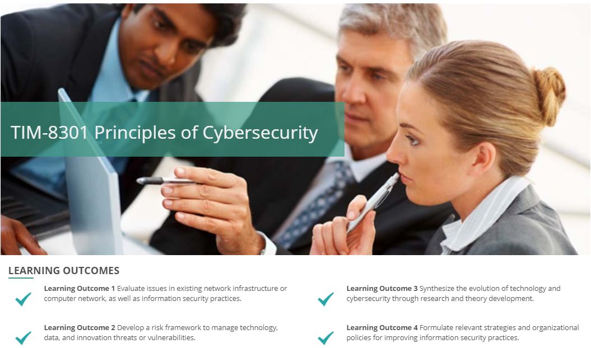

# TIM-8301: Principals of Cybersecurity

This course is an overview of security principles and practices to support executive security professionals to protect their information systems and computer networks from cyberattacks. In this course, you will study advanced and emerging topics in technology, its security features and control structures, security management and leadership, as well as techniques that are relevant to organizations that focus on technology and innovation.

## Course Concepts

## Course Outline

### Section 1: The Issues and Scope of Cybersecurity

- Week 1: Topics and Scope of Cybersecurity
- Week 1 Assignment: Evaluate Cybersecurity (10 points)
- Week 2: People and Psychology
- Week 2 Assignment: Assess and Improve the People Aspects of Cybersecurity (12 points)
- Week 3: Cyber Espionage and Global Influences
- Week 3 Assignment: Evaluate the Global Cybersecurity Position for a Significant Organization (12 points)
- Week 4: Malware and Encryption
- Week 4 Assignment: Analyze Malware and Encryption Options (11 points)

### Section 2: Risk, Mitigation, and Controls

- Week 5: Risk Frameworks and Models
- Week 5 Assignment: Appraise Risk Analysis, Frameworks, and Models (11 points)
- Week 6: Risk Mitigation and Control
- Week 6 Assignment: Produce a Risk Mitigation, Continuity, Control, and Disaster Plan (14 points)

### Section 3: Protecting an Organization

- Week 7: Innovation, Change, and Evolving Risks
- Week 7 Assignment: Prepare for Future Needs (10 points)
- Week 8: Addressing an Organization’s Needs
- Week 8 Assignment: Signature Assignment – Integrate a Strategic Cybersecurity Approach (20 points)
