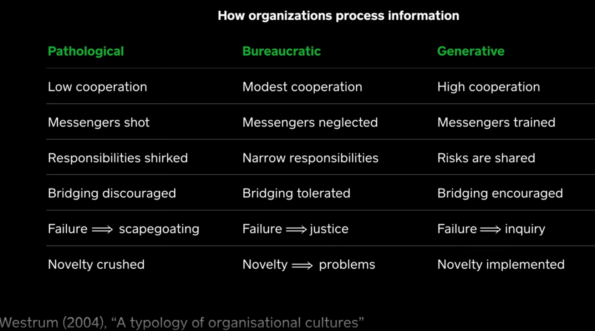
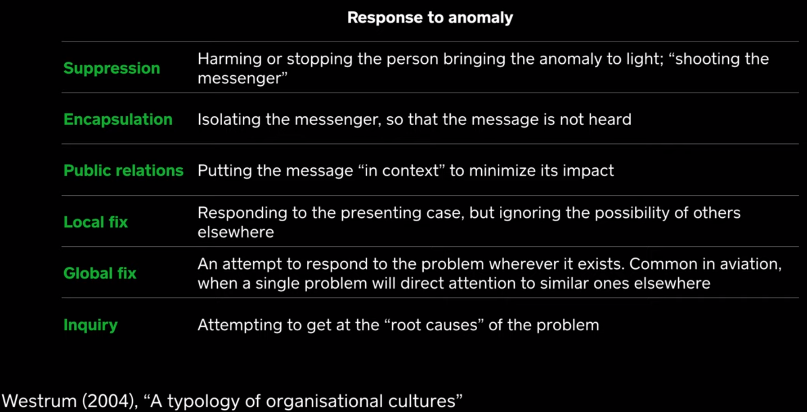

# Black Hat USA 2019 Keynote: Every Security Team is a Software Team Now by Dino Dai Zovi (2019)

On _August 26th, 2019 in Las Vegas_; [Dino Dai Zovi](https://www.youtube.com/watch?v=8armE3Wz0jk) discusses

## Jeff Moss (1:22)

- how do we communicate these risks to different audiences, these soft skills are the source of 80% of our problems.
- decentralization vs centralization
- locality and the influence of laws that control the geography of the internet
- the influence of automation and how it hides opaque decisions
- cultural translation of ideas, e.g., in identity is not a concern because farms sell their identity for 3k versus ddos protection is expensive because the great firewall masks the identity -- and CDN is really expensive because of the decentralized nature of chinese datacenters

## Philip Courtot (16:22)

The chairman and ceo of Qualys the evolution of software towards "everything as a service" and how layering new security ontop is no longer a reasonable approach.

## Dino Dai Zovi (18:42)

Remineses about the evolution of blackhat over the last 20 years, more than just guessing the passwords, its _about deconstructing how things work and using automation becomes a force multiplier_.  Then the industry transitioned towards finding vulnerabilities and reporting them, but we grew beyond this and into browser exploits.  Meanwhile organizations were still so much more basic, such as patch management and drive by exploits.

Around 2014, working at Square, he learned that security engineers are engineers and need to meet the same bar.  This creates a culture where teams want to interact with security teams, and how security engineers translate from critism to a shared resource.  _Software is the universal substrait of value_, and not all critism is beneficial.

### Specification before Implementation (34:30)

When systems begin with a specification they are overly complicated and do not meet the needs of the audience.  Instead, projects need iterative design that is simple and performs the specific needs in the shortest amount of time.  This approach leads to _performing the job requested, not some unrelated task_-- `the worst is better principal` with simplicity over complexity.

Steps to building systems (34:30):

1. Work backwards from the job
2. Seek and apply leverage
3. Culture >> Strategy >> Tactics

Core prinicpals of agile (43:04):

1. Individuals and Interactions over processes and tools
2. Working Software over comprehensive documentation
3. Customer Collaboration over contract negotiation
4. Responding to Change over following a plan

Homework:

1. Talk to Five customer teams
2. Understand their struggles
3. When and why "hire" security
4. What are their "hiring criteria"
5. What are their" firing criteria"

Seeking and Applying leverage

- There's focus on reliability and not including observability
- Automation like fuzzing scales horizontal and vertically, instead of smart code reviews
- Making fuzzing easier for developers transitions grows the adoption

Culture over Strategy over Tactics

- Dev & ops cooperation at Flickr - 10 deloys per day - Allspaw & Hammond (2009)
- Its more about changing culture than having good tools
- Embracing change, and making teams own their quality
- Cultivating Empathy shifts towards generative cultures
- Don't start with no, `start with yes and here's how we can help`
- Be like a ski-diver and manage fear - Bill Booth -- understood the job that people wanted to hire for

