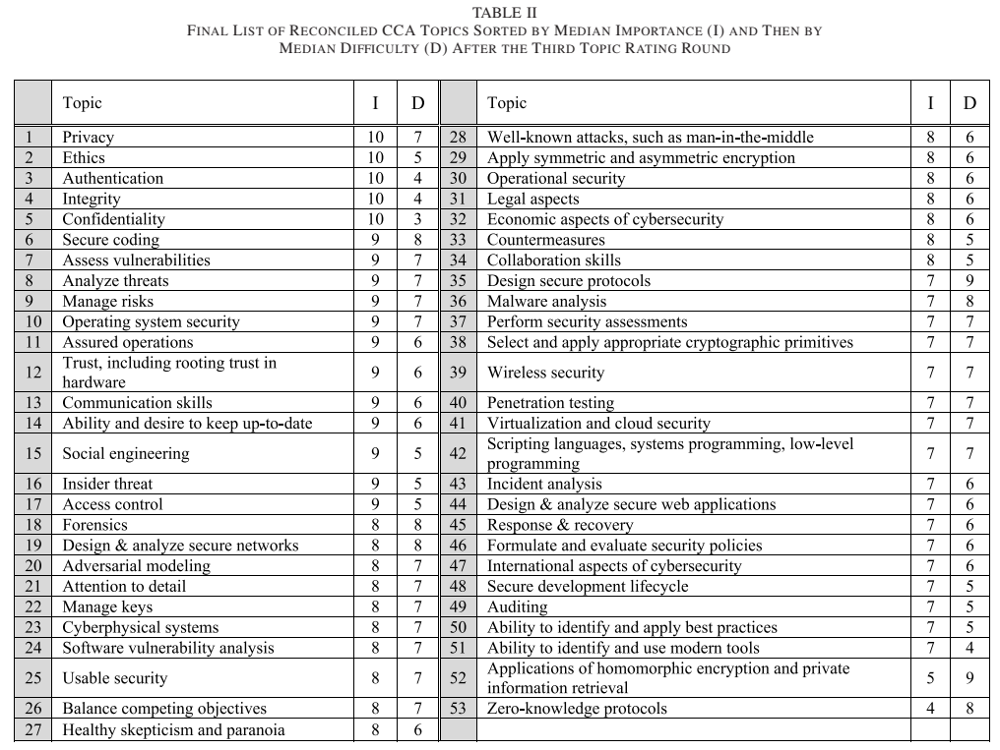

# Readings

## A Primer on Data Security (2015)

In _CPA Journal; May2015, Vol. 85 Issue 5, p58-62, 5p_; [Brown, T](Primer_on_DataSecurity.pdf) states that data breaches cost millions of dollars damage, though individuals do not believe they are being targeted.  This misconception worsens for specific roles, like accountants and CPAs, because they have access to large quantities of financial information.

### Who breaches security

- Whitehats: Good guys
- Blackhats: Bad guys
- Greyhats: Bored guys
- Havtivists: Politically motivated
- State Sponsored: Well-funded bad guys

### How are they exploiting the systems

> Of the 268 data breaches the U.S. government faced between 2009 and 2012, more than two-thirds were caused by loss of a device, records, or the negligent disclosure of information (William Jackson, “Forget Hackers, the Fool Next to You Is the Real Threat,” GCN.com, Sep. 19, 2012).

The number one point of failure continues to be the human, as this is easier to attack than software technologies.  There are other aspects of security that need consideration.  For instance, physical security in the event of natural disasters, and how this impacts `business continuity`.  Security needs to address multiple layers, such network protection (e.g., intrusion detection/prevention), antivirus, and edge firewalls.  Similar to other technologies, these solutions have a lifecycle and need periodic replacement.

## Commentary: Collaborating to Achieve a Mutual Cybersecurity Advantage (2017)

Hagestad B, Straumann A. Commentary: Collaborating to Achieve a Mutual Cybersecurity Advantage. Biomedical instrumentation & technology. 2017;51(1):34-39. doi:10.2345/0899-8205-51.1.34.

In _Biomedical Instrumentation & Technology [Biomed Instrum Technol] 2017 Jan-Feb; Vol. 51 (1), pp. 34-39._; [Hagestad, B; Straumann, A](MutualSecurityAdvantage.pdf) describes the _health care medical device landscape_, as having poor security configuration and are not frequently upgaded.  These devices have access to the hospital networks and can become an high risk attack vector.  The manufactures and the health care industry need to define processes that increase protections.

Part of the problem is due to inefficient budgets, while other aspects are due to poor defaults (e.g., allowing FTP/telnet versus SFTP/SSH), and training also play a large part.

## Privacy and Security Online: Best Practices for Cybersecurity (2018)

In _Library Technology Reports. Apr2018, Vol. 54 Issue 3, p1-37. 37p_; [Hennig, N](PrivacyOnline.pdf) is a four chapter read around privacy in the modern world.

### Where can I read about infosec

- [Schneier on Security](https://www.schneier.com)
- [Krebs on Security](https://krebsonsecurity.com)
- [EFF](https://eff.org)
- [EPIC](https://epic.org)

### What to consider in a threat model

1. What do I want to protect?
2. Who do I want to protect it from?
3. How bad are the consequences if I fail?
4. How likely is it that I will need to protect it?
5. How much trouble am I willing to go through to try to prevent potential consequences?

### What benefits and challenges exist to backing up devices

It's generally agreed that backups are critical, though they never seem to be complete or recent.  There needs to be considerations for how that data is protected through encryption and redundancy, as the loss could be someone elses gain.  For example, an unencrypted phone contains credit card information and cached credentials to online personas.

Mobile payment technologies, like Apple Pay, can protect specific aspects of this problem by keeping the credit card numbers off of the device.  Instead, they live in the cloud and each swipe uses a one-time token.  Other solutions, like Multifactor Auth (MFA) can also remove the risk of those cached credentials.

## Defining Cybersecurity Law (2018)

In _Iowa Law Review. Mar2018, Vol. 103 Issue 3, p985-1031. 47p._; [Kosseff, J](CybersecurityLaw.pdf)...

## Identifying Core Concepts of Cybersecurity: Results of Two Delphi Processes (2018)

In _IEEE Transactions on Education (Volume:61, Issue:1 , Feb. 2018)_; [Parekh et al.](CoreConcepts.pdf) use a [Delphi Process](https://www.investopedia.com/terms/d/delphi-method.asp),group concensus strategy, to identify core concepts of cybersecurity.  The strategy enumerates multiple rounds of anonymous voting followed by broadcast of vote counts.  This causes a heard mentality towards the collective voice.

Those concerns are broadly categorized as:

- You intentionally give away my information
- You accidentally give away my information
- I accidentially give away my information
- They stole my information
- My security department hinders me giving away my information
- My security protocols protect me from giving away my information
- My software intentionally gives away my information
- Attackers use vulnerabilities in my software to steal my information
- I can't tell that they stole my information

## Business and cyber peace: We need you! (2016)

In _Business Horizons Volume 59, Issue 5, September–October 2016, Pages 539-548_; [Shackelford, S](Business_CyberPeace.pdf) propose the idea of _cyber peace_ itself is defined in the context of how businesses can promote peace generally, and then how that goal can be attained by working together.  The authors continue with examples of how we need to be ethical with the global ecosystem, as those unethical actions cause havoc on the industry.  The artical reads a somewhat liberal, but there is humor sprinked through out.

## Cybersecurity Standards Are Standing Up to the Bad Actors (2017)

In _Biomedical Instrumentation & Technology 2017 Sep 02; Vol. 51 (s6), pp. 7-8._; [Vargas, W](SecurityStandards.pdf) states that bad actors arbitrarily attack all devices, including medical equipment, and the creates the need for best practice standards.  For instance, [ISO 14971](https://en.wikipedia.org/wiki/ISO_14971) defines industry patterns and consistent patterns.
