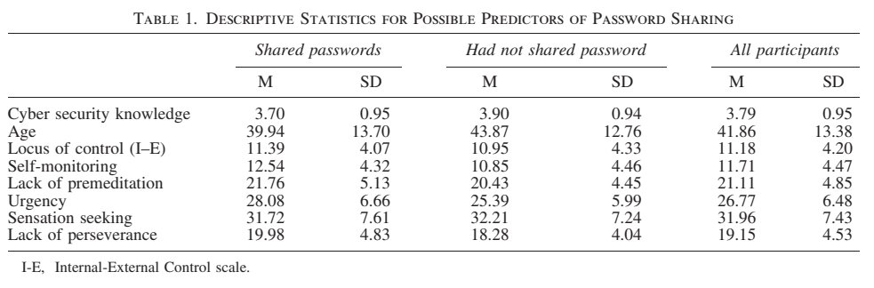

# Readings

## Gender difference and employees' cybersecurity behaviors (2017)

In _Computers in Human Behavior Volume 69, April 2017, pg 437-443_; [Anwar et al.](GenderBehaviors.pdf) explores the role of gender and age into an understanding of security best pratices, and found that age and awareness are more influential.  Generally speaking, choosing a random demographic dimension does not dictate a groups ability to follow governance policies.  While specific groups might require more accessibility options, these are more often communication gaps in the expectations between the users and administrators.

If the administrators require a class of five year olds to have complex passwords, then they are living on different planet.  Instead, the admins should limit the access of those children and accept the risks of their accounts being compromised.  When those accounts are compromised, there needs to be an ability to recover their data and revert to a known state.

## Costly but effective: Comparing the factors that influence employee anti-malware behaviours (2018)

In _Computers in Human Behavior Volume 87, October 2018, pg 87-97_; [Blythe, J; Coventry, L](AntiMalwareChoices.pdf) explores the behavior economics of anti-virus operations, and found that interacting with malicious emails remains a critical concern.  Humans are inheritely not skeptical towards these interactions, because they believe no one is out to target me personally.  This perspective is erroneous because they are a member of a cluster, and the cluster is being attacked.

## Theoretical analysis of cyber-interpersonal violence victimization and offending using cyber-routine activities theory (2017)

In _Computers in Human Behavior Volume 73, August 2017, Pages 394-402_; [Choi, K; Lee, J](ViolenceVictimization.pdf) finds that the Internet is full of bullies, and that everyone encounters the trolls to a certain extent.  However, there is a small group of people that are disporportionally impacted, such as women and minorities, that deal with these challenges.

## Why Should I? Cybersecurity, the Security of the State and the Insecurity of the Citizen (2018)

In _Politics and Governance Volume 6, Issue 2, July 2018; [Coles-Kemp, L; Ashenden, D; O'Hara, K](Why_Should_I.pdf) discusses the role of `Sovereignty` and the asymetry of control between governments and citizens, leading to distrust and skepticism that big brother has our interest in mind.  The survey also found that security lacks legibility because it relies on complex mathmatical models that are not well understood.  For the general public, they do not get these technologies, and think its all an evil black box of doom.

## Building Cybersecurity Awareness: The need for evidence-based framing strategies (2017)

In _Government Information Quarterly Volume 34, Issue 1, January 2017, Pages 1-7_; [Bruijn, H; Janssen, M](BuildingAwareness.pdf) is an excellent article on how to communicate security messages and frame the conversation.  Historically, experts have tried to frame the discussion as "theres hackers with hoodies out to get us" and neglected to focus on the real risks that surround us every day.  They draw a parallel to global warming, and how the scare us into compliance has backfired and holds the community in a state of disbelieve and assumption that its a hoax.

## Minimizing Insider Threat Risk with Behavioral Monitoring (2018)

In _Review of Business. 2018, Vol. 38 Issue 2, p61-73. 13p._; [Elifoglu, H; Abel, I; Tasseven, O](MinimizingInsiderThreat.pdf) discusses the challenges of insider attacks, from sources like disgruntled employees.  These team members have the ability to abuse the organizational trust, and perform malicious actions along with cover them up.

The authors provide statistics around the number of cases that end up in the legal system -- roughly 3%.  Part of the challenge comes from the business not wanting to loose face and admit to the general public that the incident occurred.  It is in their best interest to terminate the employee and keep things quiet.  Three example stories are provided that describe former employees leaving with large quantities of sensitive data, only to be arrested by the FBI.  Risk management strategies need to consider how these scenarios can be more efficiently audited and authorized.

## Security system with 3 dimensional face recognition using PCA method and neural networks algorithm (2017)

At _2017 4th International Conference on New Media Studies, Yogyakarta, Indonesia, 8-10 Nov. 2017_; [Jonathan et al.](FacialRecognition.pdf) describes a how facial regnoition system works, and expands on the ideas of MultiFactor Authentication (MFA) to pair _something you know and something you have_ with _something you are_.  Having three factors of authentication increases the complexity for a malicious use of identity.

The general approach uses a Microsoft Kinect to create the 3-D facial map, then they use Prinicpal Component Analysis (PCA) (see: [TIM-8130 DataMining](https://github.com/dr-natetorious/TIM-8130-Data_Mining)) to reduce the number of dimensions to a manageable amount (512x424 to 80x80).  These remaining value points were fed into a neural network to map the values to a binary output (confidence the person is known).

## Hacking into China's Cybersecurity Law (2018)

In _Wake Forest Law Review, 53(1), 57-104_; [Lee, J](ChinaSecurityLaws.pdf) provides a historic analysis that fed into China's desire for an abstract policy around cybersecurity.  This approach enables the country to make sweeping changes around any scenario that they disagree with, under the disguise of safety.  This has created specific challenges for other countries as it forces them to make the decision that business with china means handing over control to china. [Krebs, C](../Week1_Evaluation/Readings/Keynotes/ICCE2019.md) also touches on this point, stating that organizations need to enter these agreements with eyes wide open.

To their credit there are several advantages around projecting the notion of national sovereignty into the digital world.  Since the infrastructure runs in China, they want the data contained within those systems to follow a similar fate.  With the requirement to store information in China under their control it also protects the chinese people, because they cannot lose their data due to a political dispute with e.g., USA.  Even if Trump huffs and puffs, there is no risk to busines continuity of the technology consumers.  

It also means that rights of search and seizure are rigid on the Internet, and we need to consider the influence of Geography on the digital landscape.  This also aligns with [Moss](../Week1_Evaluation/Readings/Keynotes/Blackhat2019.md)'s observations that we are trending towards many Internets instead of a global network.

## The Role of Human Factors/Ergonomics in the Science of Security: Decision Making and Action Selection in Cyberspace (2015)

In _Human Factors 2015 Aug; Vol. 57 (5), pp. 721-7_; [Proctor, RW; Chen, J](ScienceSecurityDecisionMaking.pdf) explores the challenges with humans determining that a resource is real or spoofed.  For instance, phishing attacks continue to be highly effective because our decision process does not properly identify these risks.  Similar challenges also arise from mobile apps and our inability to make accurate security critical decisions.

## Addressing Malware WITH Cybersecurity Awareness (2017)

In _ISSA Journal. Oct2017, Vol. 15 Issue 10, p16-22. 7p._; [Valiente, C](AddressingMalwareAwareness.pdf) nicely articulates the distribution of problems as 50% criminal, 25% technical glitches and 25% human error.  While it can be difficult to address the criminals, building reliable and fault tolerant systems is well within our wheel house.  Similarly, educating humans to be more causious and be aware of the risks that can arise from their actions significantly reduces the attack surface.  Businesses should be laser focused on these aspects as a means to mitigate risk.

## Individual differences in cyber security behaviors: an examination of who is sharing passwords (2015)

In _Cyberpsychology, Behavior And Social Networking 2015 Jan; Vol. 18 (1), pp. 3-7_; [Whitty et al.](SharingPasswords.pdf) examines the scenarios that cause password sharing.  They conclude that psychology plays an important role in answering why users share passwords.

