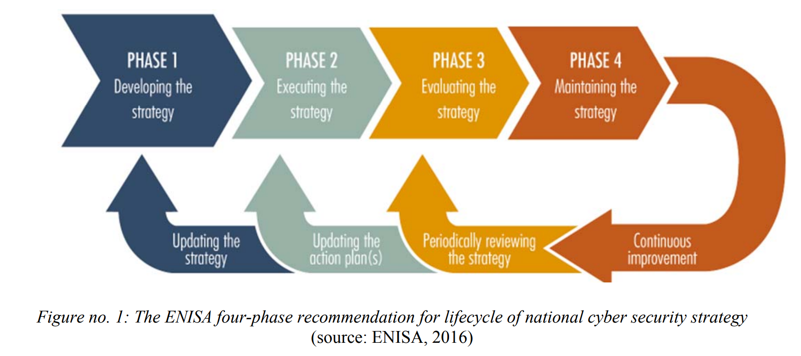

# Readings

## CYBER ESPIONAGE AND ELECTRONIC SURVEILLANCE: BEYOND THE MEDIA COVERAGE (2017)

In _Emory Law Journal; 2017, Vol. 66 Issue 3, p513-525, 13p_; [Banks, W](CyberEspionageBeyondMedia.pdf) describes the duality of the Internet as both a mechanism for increasing communication while decreasing privacy.  Espionage attacks occur in high volumes against individuals, corporations, and nations.  These attackers steal intellectual property, something that was not taken seriously until the 2007 theft of Google's source code.

The US sued the Peoples Liberation Army but did not have the jurisdiction to charge Chinese nationals in China-- their govt argued that it was no different than what americans do to them.  According to China, spying on public or private organizations is the samething, and since the US actively spied on Chinese public institutions there is no real difference.   This perspective ties into arguments by Matsubara(2014)(see below).  Without consistent vocabulary, the rules will never be consistent.  In 2015, China and US agreed to a treaty where Chinese state sponsored espionage would decellerate, and PLA members that moonlight stealing trade secrets for sell on the black market would be arrested.

ISIS has been successful with their media campaign that broadcasts aspects of their message far and wide.  The remainder has remainded in the shadows, predominately due a heavy dependence on encryption.

### What is the role of International law

Countries are good at enforcing laws that apply to their citizens interacting with their local hardware.  However, when an attack takes place outside the border, then it becomes a matter of International law.  These laws are more of guidelines, and unless sovereignty of a specific nation is violated, no one really cares -- wild west.

For the most part countries tolerate spying because they all do it, but spying in cyberspace is unbalanced with more developed nations have more resources to carry sophisticated monitoring everywhere.

The alternative perspective states that U.N. Charter Article 51 self-defense rights. Preparing for and anticipating an armed attack is critically important in the modern world, the argument goes. If not affirmatively allowed as an adjunct to Article 51, others maintain that espionage has been recognized by widespread state practice and thus is supported by a norm of customary international law.

### How can we improve this scenario

The authors argue that states should have different rules for spying on public versus private institutions.  While there is merit in governments needing information for defence, stealing from the private sector and enforcing rules to ensure sovertigty does not cut it.  They highlight that international intellectual property theft costs the global economy between 3-600 billion annually.

However, this perspective employees a very Western view.  For socialist countries, the distinction is more fuzzy than a pure capalist society, and without a well defined border the rules cannot be enforced.  In a lot of ways, this would be like saying that spying on the Department of Motor Vehicles (DMV) is OK but not Department of Transportation (DOT).

## The Role of Healthcare Technology Management in Facilitating Medical Device Cybersecurity (2017)

In _Biomedical instrumentation & technology 2017 Sep 02; Vol. 51 (s6), pp. 19-25._; [Busdicker, M; Upendra, P](MedicalDeviceSecurity.pdf) discusses patterns and practices for adding security into medical devices in the presence of finite resources.  Despite nearly 41% of medical device manufactures agreeing that: _within one year an attack against their product was likely_, only 17% has taken significant steps to prevent it.

These attacks have evolved from information theft into `ransomware`, where the sensitive data is encrypted and the malware authors then sell the decryption key.  The unavailability of both data and technology systems in health care, can introduce undue harm to patients and prevent them receiving time sensitive attention.

Mitigating these attacks requires better communication across the ecosystem, from the device manafactures to the IT staff that support them in production.  `Awareness` of proper lifecycle management can reduce the attack surface and lessen the chances of compromise.  For instance, the devices require patching and archival solutions.  When these _internal solutions_ are not available, then an _external solution_, like network access controls (NACL) must exist to provide those security guarantees.  These solutions are not limited to technical systems, but also require manual inspection and inventory.

Communication also means sufficient training of non-technical staff, so they know the dangers associated with decisions. For example, a nurse might connect a sensitive device to the guest WiFi instead of a secure Access Point (AP).  While this has resolved the connectivity issue it also allows for malware to discover and interact with it.  Later, moving the device back to the private network could bring that malware into the trusted environment.

The lifecycle management does not end with the device being turned off.  It needs to exend through a secure termination and destruction process, so that private information does not leak into the physical recycle bin.

## Unhackable quantum networks take to space [News] (2017)

In _IEEE Spectrum (Volume: 54 , Issue: 8 , August 2017), pp. 12-13_; [Choi, C](QuantumNetworking.pdf) writes an article about quantum networking in space (QNS).  QNS relies on entanglement and has proven to work though the detection rate is very poor 1 per 5.8m pairs per second.  Newer technologies are focusing on lasers instead of entanglement and hope to have something commercially available within 5+/- years.  

In [TIM-7020 Week 6](https://github.com/dr-natetorious/TIM-7020-Database_and_Business_Intelligence/tree/master/Week6_CuttingEdge_Proposal), a detailed analysis of Quantum technologies is available and how these concepts can be applied to software design patterns.  

## ZERO-DAY RESPONSIBILITY: THE BENEFITS OF A SAFE HARBOR FOR CYBERSECURITY RESEARCH (2017)

In _Jurimetrics: The Journal of Law, Science & Technology. Summer2017, Vol. 57 Issue 4, p483-503. 21p._; [Emery, A](ZeroDayResponsibility.pdf) states that zero-day exploits, _there are zero days in which to prepare for the threat_, are openly sold on the internet.  The national defence department and criminal organizations, purchase large quantities of these issues for survaillence.  A core challenge with regulating this industry is that it requires an overhaul of the cybersecurity laws, so the authors propose leveraging tort laws (see [LAW531 Week 2](https://github.com/dr-natetorious/LAW-531_Business_Law/tree/master/Week2_Torts)).  Another challenge comes from `awareness` that these zero-day attacks are launched against individuals, corporations, and governments through _spray attacks_ (eg., drive by exploitation) and there is significant risk.

### What is a software vulnerability

> According to Microsoft Security Response Center [a vulnerability] is "a weakness in a product that could be used by an attacker to compromise the integrity, availability, or confidentiality of that product."

These issues originate from poor configurations, software design flaws, code defects, and missing features.

### How are zero-days regulated today

1. Calling on criminal law to regulate the market (e.g., Computer Fraud and Abuse Act)
2. Proposing liability to developers that release zero-days (eg, sue for negligence of release and vendor)
3. Advocating for export controls and laws to regulate trafficing (eg. Waasenaar Arrangements)

While these approaches prevent legitimate businesses and research, it does not prevent malicious actors nor nation states.  Responsible research is necessary for the legitimate actors to build protections into their systems and create security guarentees.  When legislatures propose suing the vendors for allowing the defect in the first place, this is a slippery slope, because building error free applicaitons is near impossible.  Even relatively obvious issues are often only visible after the fact.  Another challenge with legal processes is that they move substantually slower than technical innovation, and are unlikely to keep pace with a rapidly evolving landscape.

## China’s Three Warfares Strategy Mitigates Fallout From Cyber Espionage Activities (2016)

In _Journal of Strategic Security, Vol 9, Iss 2, Pp 47-71 (2016)_; [Emilio, I](ChinaWarfare.pdf) states that China has three fronts to its cyberwarfares strategy: `media, legal, and psychological`-- and uses these to influence the international community and delay effective mitigations.  So far they have been fairly successful, delivering on time according to defense timelines and minimizing any real sactions.

### What is Chinas national objective

China has three primary national security objectives: Sustaining regime survival, defending national sovereignty and territorial integrity, and establishing China as both a regional and national power.  China views the United States with a cautious mix of skepticism, partnership, and competition.

### How does this align with their culture

China has a culture that centers around building relations and showing good face.  While this seems to contradict the perspective that they are openly hacking the internet, this is easy for the two mindsets to run parallel.  This is because the attacks are non-violent methods to subdue the enemies.

- *Psychological Warfare* – Undermines an enemy’s ability to conduct combat operations through operations aimed at deterring, shocking and demoralizing the enemy military personnel and supporting civilian populations.
- *Public Opinion/Media Warfare* – Influences domestic and international public opinion to build support for China’s military
actions and dissuade an adversary from pursuing actions contrary to China’s interests.
- *Legal Warfare* – Uses international and domestic law to claim the legal high ground or assert Chinese interests. It can be employed to hamstring an adversary’s operational freedom and shape the operational space. Legal warfare is also intended to build international support and manage possible political repercussions of China’s military actions.

## CYBERSECURITY -- the No. 1 threat facing manufacturers (2018)

In _Industrial Management. Jul/Aug2018, Vol. 60 Issue 4, p24-27. 4p._; [Erickson, A; Neilson, T](CyberSecurityManufactures.pdf) states that manufactures are a primary target for cybersecurity attacks and need to be aware of the risks.  Many manufactures do not believe that they are at risk and this makes them vulnerable.

> Hackers largely target the manufacturing industry to steal trade secrets, business plans and valuable intellectual property.

### How are they being attacked

- Espionage and Intellectual Property Theft
- Ransomware for Revenue
- Pure destruction and harm

### Impact of attacks

- Harm to reputation
- Destruction of data
- Loss in productivity
- Theft of intellectual property
- Theft of personal employee data
- Disruption to business continuity
- Damage to physical facilities
- Liability or fines for noncompliance with data-privacy regulations
- Possible legal action by customers and employees whose personal information has been breached
- Possible employees suing for lost wages if the company can’t pay due to the breach
- Costs of remediating the damage itself

### What is password spraying

An effective low-tech strategy is to run password cracking across the org instead of an individual account.  By guessing across all accounts that "12345" is the password it avoids detection and an individual account becoming disabled.

### How should we approach cybersecurity risk

The organization needs to define the risks towards its continutity, and then from the C-level down be responsible through ownership.  Challenges from cyber attacks need the same attention as any other aspect, such as supply chain shock or cash flow management.  When these issues are ignored they become a timebomb that will eventually cause a distruption and impact the companies ability to deliver success.

## Deterrence is Not a Credible Strategy for Cyberspace (2017)

In _Orbis Volume 61, Issue 3, 2017, Pages 381-393_; [Fischerkeller, M; Harknett, R](Deterrence.pdf) states that military might heavily rely on the notion of `deterrence`, which says if someone attacks us we'll retalliate 100x fold.  The US cybersecurity doctorane continues to follow this mentality; even though it does not logically align with the structure of the Internet.  Not only are many threat actors small groups, but there is a low barrier to entry.  Due to the ubiquitous access to cloud technologies, anyone with a few bucks can harness thousands of compute cores.  The landscape has drastically changed to not being about planes and tanks, instead, its the wild west where anyone can become someone.

### What are the influences from historical solutions

Another challenge comes from most foreign policy is built ontop of the Thirty-Years War Treaty (central Europe 1618-48), which declares that no country should show force, and this `operational restraint`.  However, many groups (individual and national), are finding that aggressive positions are more effective at maintaining control.  Since, there is no consistent definition of cyberattacks, how can there be shared agreement of behavioral norms?

After World War II (WWII), a similar mentality continues but from the perspective of `cost/benefit analysis`-- that builds systems where it costs 10$ to get 1$ value.  This discourages an attacker from going through the hassle and its not worth the effort.  However, in cyberspace many system values are abstract and the same calculus is not always applicable.  When this fails, _indirect costs_ such as economic sanctions arise as a proxy, though what does it mean to sanction a country because of rouge hackers within that nation? "[it] —should be recognized for what it is—the addition of weaker forms of punishment because robust costs cannot be credibly imposed."

Instead, international security policy needs to break away from a mindset that is nearly 400 years old.  This new perspective should center around `Sabotage, Espionage, and Subversion`.  Mechanisms need to exist that constrain the blast radius and defend through innovation not troops.  The number of advisaries is increasing every day and these evolving challenges need different tools.

###  How can we improve this scenario

While deterrance in the physical world is a well understood problem, it does not apply to the digital universe.  The authors recommend instead that the US govt should be on a warpath, and operate as a persistent that "pwns for the lulz."  They suggest moving by transitioning away from restraint towards force, it recreates the notion of deterrence through real force.  While escalation in the physical world would result in physical war, in the digital world there attacks can turn off systems instead of destroy them.

The authors also suggest that by embracing the lack of `sovereignty` across the Internet, they could freely move about with impunity.  What could possibly go wrong here?   While it is an interesting(?) idea, its suspecious that anyone would be safer for the same reasons that full aggression are not helpful.

## Cyber espionage. China's Cyber Power (2015)

In _Adelphi Series (Vol. 55, pp. 51-82)_; [Inkster, N](ChinaCyberPower.pdf) describes how between 1994-2014 China grew to be an enormous presence on the Internet, with four of the top ten Internet businesses Chinese.  President Xi has made it a mission to place China on the forefront of governance and take control of the previously American centric technology.  Putin has also made multiple UN Resolutions (1998) to frame the Internet as a military weapon, and this gives them the right to control and regulate it.  Other authoritarian states jumped on the bandwagon and immediately began to kill the notion of an internet without borders, and instead focus on mechanisms to protect their sovereignty.  Meanwhile democratic nations promoted the idea of removing censorship and making security the central issue.

## The birth of cyberwar (2015)

In _Political Geography Volume 46, May 2015, Pages 11-20_; [Kaiser, R](BirthCyberwar.pdf) before 2007, the idea of cyberwar was more theortical risk than an actuality, when events in Tallinn "fired the imagination."  Part of the reason why this event gained such attention is that _Live Free, or Die Hard_ was playing in theatres at the time.  The movie features Bruce Willis versus a cybersecurity ex-military villian that compromises the US infrastructure -- which was very similar to the events occurring in Tallinn (Estonia).  After handling those attacks and gaining wide spread media attention, Estonia became the global experts for dealing with an attack.

## CYBER SECURITY POLICY AND STRATEGY IN THE EUROPEAN UNION AND NATO. (2018)

In _Revista Academiei Fortelor Terestre. 2018, Vol. 23 Issue 1, p16-24. 9p._; [Kovacs, L](PolicyStrategyEuropeanUnion.pdf) recalls that in 2008 Europe needed a forward looking strategy to get out of the Great Recession.  A core pillar of the Europe 2020 program centered around a digital economy that was safe, secure, and highly reliable.  

In 2013, the European Security Strategy formalized these ambitions, specifically (European Commission, 2013, p. 4):

- Achieving cyber resilience,
- Drastically reducing cybercrime,
- Developing cyber defence policy and capabilities related to the Common Security and Defence Policy (CSDP),
- Develop the industrial and technological resources for cybersecurity,
- Establish a coherent international cyberspace policy for the European Union and promote core EU values

The security posture of the EU continues to evolve from these expectations, including such policies as General Data Protection Regulation (GDPR), which seeks to protect the soverignty of the EU by allowing it to enforce legal mandates.  Since the infrastructure is local to their nation this becomes much easier and avoids the need to fight with international laws.

## NATIONAL CYBER SECURITY AS THE CORNERSTONE OF NATIONAL SECURITY (2018)

In _Revista Academiei Fortelor Terestre. 2018, Vol. 23 Issue 2, p113-120. 8p._; [Kovacs, L](CyberSecurityCornerstone.pdf) points out that each nation is independently creating a cybersecurity strategy, and a lack of consistency causes there to be gaps in the implementations.  This issues really comes back to another pivot of the Internet has no borders but the infrastructer does very much so.

Countries that are more advanced have more attack surface and need more mature processes, but that does not mean that developing countries should not have solutions.  The level of involvement from the government varies significantly, such as UK acknowledges that private industry is better suited and should innovate while govt focuses on least common denominator.  However, other countries like Russian and China do not see such as clear separation between public and private industries.  Without commonality, a once sizes fits all cannot exist and _multinational corporations are stuck navigating through complex legal and poltical processes_.

### What are policy continuums

There are many aspects of security that represent policy continuums versus discrete yes/no decisions.  Consider data sharing vs protection and how they are at odds with each other.  Freedom of speech and govt stability also influence what are acceptable usages of products in `culturally sensitive contexts`.  Per country policy, the location within that continuum needs to account for [1] govenrment, [2] society, and [3] international actors-- where givening power to one requires taking it from the other two. 

### How can we move towards commonality

The _European Union Agency for Network and Information Security_ is a guidebook of best practices and that expert panels have proposed.  While there is no guarantee that nations will end at similar policies, having a common starting point results in similar themes.  Perceived costs and political disagreement prevent this model from being perfect.  However, by at incorporating shared values it simplifies future integrations and sharing processes across national borders. 

## Countering Cyber-Espionage and Sabotage (2014)

In _RUSI Journal: Royal United Services Institute for Defence Studies, 159(1), 86-93_; [Matsubara, M](CounteringCyberEspionage.pdf) reviews the partnerships between Japan and the UK around foreign policy and sharing national security concerns. 

> [B]oth countries must pursue balanced diplomacy and security strategies to meet their national defence requirements and to ensure supplies of external resources. [...] Since the Japanese and UK governments are pursuing stronger defence and economic partnerships,
one country’s vulnerability in the cybersphere could pose a risk to the other, such as disruption to business or military operations. Thus, cyber-security co-operation is crucial for their economic prosperity, social welfare and national security.

### Why are international partnerships complex

1. A consistent definition of cyber-attacks does not exist in the international community, which causes regulation and compliance requirements to vary between different localities.  For instance, in one country there maybe an expectation that data leaks are reported in a timely manner, while another might only require reporting under very specific scenarios.  This creates scenarios where even transparent organizations might be omitting critical details because they are not relevant in their culture (see [Week1 Moss](../../Week1_Evaluation/Readings/Keynotes/Blackhat2019.md)).

2. Due to security being a cross-cutting concern, there can also be multiple stakeholders with different interpretations of the rules.  These differences can lead to compliance and reporting requirements varying even between business units (e.g., Department of Finance vs Commerce).  It can also cause jurisdiction disputes over who see information or take point on investigations.

3. The Internet is borderless but its infrastructure is highly geographical and must adhere to nationally specific laws.  These laws often differ between the location of the attacker and victim, and require International cooperation to assembly sufficient evidence.  Getting access to that information is challenging due to a distrust between nationalities and concerns of disclosing vulnerabilities in their own topologies.

## How can we improve the odds for success

> To overcome these complexities, therefore, any sound scheme for international cyber-security co-operation must begin with at least the following two foundational steps: [1] detailed scoping of the area for co-operation, including at least the general objectives,  specific types of information to be shared, according to which criteria and under what circumstances; and [2] the completion of a mutually credible agreement on information assurance to protect national secrets.

If both organizations share the same `core political values`, there is a greater probability of overlapping outcomes.  For instance, when both nations can establish similar laws and legal definitions, then it becomes easier to share communications as the risks are comparable (e.g., intellectual property protections).

## Where do these issues butt-heads

The two most critical areas to overlap on agreement are: [1] cyber-espionage and [2] cyber-sabotage.  Even well intentioned deviations, like the CDC protecting membership rosters, creates a distrust between nations and impacts the flow of conversations.  Some nations, such as Japan, do not have a well-defined security clearance protocol, which can introduce challenges sharing even across departments.  There can also be multiple competing _sources of truth_, and this decentralized model can lead to ambigity. 
