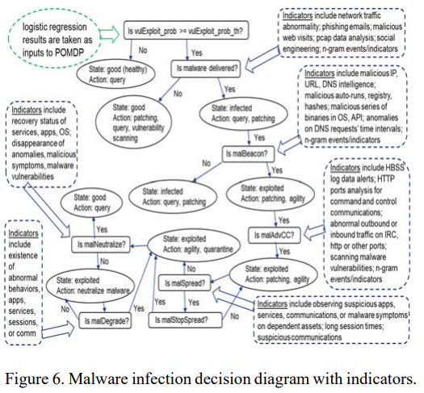

# Readings

## An improved Android malware detection scheme based on an evolving hybrid neuro-fuzzy classifier (EHNFC) and permission-based features (2017)

In _Neural Computing & Applications. Dec2017, Vol. 28 Issue 12, p4147-4157. 11p._; [Altahher, A](AndroidPermissionClassifier.pdf) states that detecting malware with signatures is challenging because of code obfuscation tooling being robust and mainstream.  Instead, they built a classifier by mining the permissions requested by various Android malware samples and goodware from Google Playstore.

During [TIM-8101 Principals of Computer Science Week 8](https://github.com/dr-natetorious/TIM-8101-Principals_of_Computer_Science/tree/master/Week8_Capstone), similar ideas were explored from the perspective of connected graph theory.

## Recon and Respond to Malware Threats in the Cloud (2017)

In _ISSA Journal. May2017, Vol. 15 Issue 5, p22-27. 5p._; [Balupari, R; Singh, A](MalwareInClouds.pdf)

## Online detection and control of malware infected assets (2017)

At _Paper presented at the Military Communications Conference, Baltimore, MD_ [Cam, H](DetectionControlMalwareInfected.pdf) combines logistic regression and partially observable markov decision processes (POMDP) to detect when assets become compromised with malware.  The objective of LR is to determine the likelihood of exploitation by considering features, such as open ports and results from vulnerability scanners.  These probabilites feed into a POMDP model to assess the likelihood of transitioning into a compromised state by cross referencing intrusion detection logs through reinforcement learning.  Once the state and risk is known, remediation policy can automatically protect the resource through actions such as patch management and network quarintine.

One of the challenges with traditional Intrusion Detection/Prevention System (IDS/IPS) is the noise from high false positive rates.  This approach reduces those issues by considering the asset state in the context of specific vulnerabilities.  The authors note that this would be difficult to scale because the number of known vulnerabilities is enormous causing a too many features.  In the textbook for [TIM-8130 DataMining](https://github.com/dr-natetorious/TIM-8130-Data_Mining), Witten recommends having a minimum of ten examples per feature to avoid overfitting.  Perhaps some [meta-learning or ensemble](https://github.com/dr-natetorious/TIM-8130-Data_Mining/tree/master/Week3_Application/Readings) can improve these situtations.

## Improving the effectiveness and efficiency of dynamic malware analysis with machine learning (2017)

At _2017 Resilience Week (RWS) Wilmington, DE, USA 18-22 Sept. 2017_; [Kilgallon et al.](DynamicMalwareAnalysis.pdf) states that over one million malware strains are being generated every day and this creates a need for detection models to be fully automated.  Current state-of-the-art detection relies on dynamic analysis inside of a sandbox by monitoring the runtime execution, while this approach is better than traditional signatures, advanced malware can generate false negatives by detecting those monitoring systems and simply exiting.  

> As docummented in the research conducted by Kruczkowski and Szynkiewicz [18], as well as Firdausi et al. [15], classifiers such as K-Nearest Neighbors (KNN), Naive Bayes, Decision Tree and SVM can effectively expose the malicious intent of heterogeneous malware datasets, by uncovering the underlying relationships of the features extracted from dynamic and static analysis.

For static analysis the authors used open-source [Radare2](https://www.radare.org/r/) a scriptable tool for decompiling binaries and exploring callgraphs.  Dynamic analysis occurs on open-source sandbox [Cuckoo](https://cuckoosandbox.org/).  Next, a hybrid approach extracts features (e.g., system call sequences) to build a classifier of malware vs goodware that was 90-2% accurate.  Other appraoches have choosen features such as opcode sequences, function length frequencies, and presence of polymorphic operations.

### Malware Runtime Duration Classification Model

The first objective was to determine how long each sample needs to run to determine if its malicious.  They extracted features from static analysis, and ran each sample through Cuckoo with timeouts of 20,60, and 300 seconds; and assessed the confidence scores.  Each malware instance is then associated with a label to denote the level of evasion detection.

### Malware Family Classification Model

Reversing Labs holds the largest malware repository and forms the basis of many ground truth decisions.  These files were statically mined for text strings (word2vec) and PE header metadata (e.g., imports) to determine 1024 features and perform K-nearest neighbors (KNN) like comparisons.

### How did they pay for the research

Amazon has a program for free compute towards research goals - [AWS Cloud Credits for Research](https://aws.amazon.com/research-credits/)

## Zero-day malware detection using transferred generative adversarial networks based on deep autoencoders (2018)

In _Information Sciences Volumes 460–461, September 2018, Pages 83-102_; [Kim, J; Bu, S; Cho; S](MalwareDetectionUsingGAN.pdf)...

## CloudRPS: a cloud analysis based enhanced ransomware prevention system (2017)

In _Journal of Supercomputing. Jul2017, Vol. 73 Issue 7, p3065-3084. 20p; [Lee; Moon; Park](RansomwarePreventionSystem.pdf)...

## Community Finding of Malware and Exploit Vendors on Darkweb Marketplaces (2018)

At _2018 1st International Conference on Data Intelligence and Security in South Padre Island, TX, USA_; [Ericsson et al.](MalwareVendorsDarkwebMarketplaces.pdf)...

## Modeling and Analysis of the Impact of Adaptive Defense Strategy on Virus Spreading (2018)

In _International Journal of Applied Mathematics. 2018, Vol. 48 Issue 2, p146-151. 6p_; [Qingyi; Z; Longqi, L; Chenquan, G](ModelingAdaptiveVirusDefense.pdf)...

## Data driven exploratory attacks on black box classifiers in adversarial domains (2018)

In _Neurocomputing Volume 289, 10 May 2018, Pages 129-143_; [Sethi, T; Kantardzic, M](ExploratoryAttacksOnClassifiers.pdf)...

## Active Malware Countermeasure Approach for Mission Critical Systems (2017)

At _2017 IEEE 15th Intl Conf on Dependable, Autonomic and Secure Computing, 15th Intl Conf on Pervasive Intelligence and Computing, 3rd Intl Conf on Big Data Intelligence and Computing and Cyber Science and Technology Congress_; [Thomas, Z; Adelwahed, S](MalwareCountermeasures.pdf)

## Searchable attribute-based encryption scheme with attribute revocation in cloud storage (2017)

In _PloS one [PLoS One] 2017 Aug 31; Vol. 12 (8)_; [Wang, S: Zhao, D; Zhang, Y](SearchableAttributeEncryption.pdf)

## A Secure Encryption-Based Malware Detection System (2018)

In _KSII Transactions on Internet and Information Systems Monthly Online Journal (eISSN: 1976-7277)_; [Lin et al.](EncryptionBasedMalwareDetectionSystem.pdf) states that many families of malware are anti-virus aware and can perform various strategies to evade detection.  Researchers have transitioned toward machine learning to detect these scenarios, but attacks against the classification process can introduce skew, and there needs to be security mechanisms to protect the training process.

> One of the prominent challenges in the area of malware detections is that most existing malware detection mechanisms are unable to effectively deal with the situations where a malware program attempts to antagonistically confuse the malware detection mechanism by first prying into the malware detection mechanism and then changing or obfuscating its code to generate new variations of the malware according to the information obtained.

The contributions of our work are summarized as follows:

1. Aiming to enhance the detection of malware and contribute to the study on the protection of detection mechanisms, we propose a secure malware detection system in which the detection mechanism is encrypted and thus protected.
2. A privacy-preserving Naive Bayes classifier which combines the behavior-based inspection technique (for detecting malware) with the homomorphic encryption technique (for protecting the detection mechanism) is constructed.
3. The proposed secure malware detection system is based on a Naive Bayes classifier which has a considerably high successful malware detection rate (94.93%).

### So what are they doing here

The authors use dynamic analysis to determine which system calls a program makes and then attempts to classify those operations and safe or unsafe.  For instance, if the system uses [CreateRemoteThread](https://docs.microsoft.com/en-us/windows/win32/api/processthreadsapi/nf-processthreadsapi-createremotethread) to execute within a different process, that is more concerning than one that uses [CreateThread](https://docs.microsoft.com/en-us/windows/win32/api/processthreadsapi/nf-processthreadsapi-createthread) within the local process.  Since there are many system calls an `Information Gain` function associates a weight to the concern of each API based on the frequency of appearing in the goodware vs malware data sets.  Each systemcall become a unique feature with the feature set passed through Naive Bayes classification.

Communication between clients and assessment sandbox server uses homomorphic encryption (e.g., public/private keys) to create a representation of the monitoring rules, so that malware cannot learn the underlying rules in the Bayes classification.
