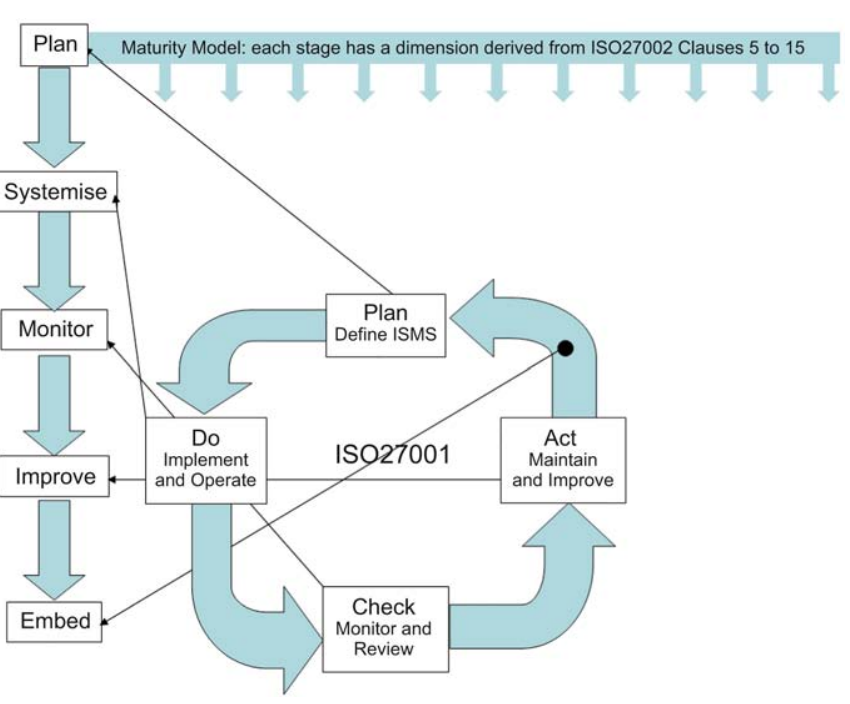

# Readings

## Integration of Information Systems and Cybersecurity Countermeasures: An Exposure to Risk Perspective (2018)

Richard Baskerville, Frantz Rowe, and François-Charles Wolff. 2018. [Integration of Information Systems and Cybersecurity Countermeasures: An Exposure to Risk Perspective](IntegratingCountermeasures.pdf). _SIGMIS Database_ 49, 1 (February 2018), 33–52. DOI:https://doi.org/10.1145/3184444.3184448.

When disjoined system become more tightly integrated it reduces management overhead and provides greater insight across the value-chain.  However, these additional systems increase the attack surface and this creates a need for additional protections (e.g., defense in depth).  For instance, two decoupled web servers run the risk that one becomes compromised.  After joining the systems to have shared levels of access to resources, the risk more than doubles as compromising one instantly compromises the other.  My claim that its more than double comes from the opaqueness that these different product groups could be responsible for the different sites.  Administrators need to understand those elevation paths across ever more complex topologies, especially given the shift toward abstract network borders.

> An information system vulnerability is the intersection of three conditions: (1) system susceptibility, such as a design or implementation flaw; (2) threat accessibility, such as system access points or services; (3) threat capability, such as an opponent with the knowledge and resources to discover, access, and exploit a flaw (Brumley et al., 2008; Hughes &
Cybenko, 2014). [...] Cybersecurity can remove vulnerabilities by eliminating one or more of these three conditions.

The authors state that as systems become more integrated the interfaces between them are standardized, and this pivots the conversation _from vulnerabilities to vulnerabile points_.  These points are more manageable through self-protection instead of relying on risk insurance, transferance and avoidance strategies.  When a countermeasure can be `self-protected` it creates a need for specific targeted mitigations against specific scenarios versus more generalize risks.

> The body of evidence above indicates that increasing information systems integration is being accompanied by increasing attention to acquisition of cybersecurity technologies. [...] Integration without cybersecurity or with fewer cybersecurity investments due to fewer vulnerability points may no longer be the option.

## Integrating cybersecurity into NAVAIR OTPS acquisition (2016)

T. Combass and A. Shilling, "[Integrating cybersecurity into NAVAIR OTPS acquisition](NavAirOTPSAcquisition.pdf)," 2016 IEEE AUTOTESTCON, Anaheim, CA, 2016, pp. 1-5.

The objective of DoD acquisition lifecycle is to [1] categorize risk, [2] define safeguards, [3] implement security controls, [4] assess those controls, [5] provide a formal review to stakeholders, [6] annually repeat the process.  This approach is similar to the software development lifecycle though more specialized for procurement rather than custom built systems.  Ensuring high standards are consistently delivered centers around OTPS requirements (e.g., has access controls and auditing) that must implement RMF (e.g., those controls minimize attack surface).

So many acronyms...

- Naval Air Systems Command (NAVAIR)
- The Operational Test Program Set (OTPS)
- Risk Management Framework (RMF):
  1. risk categorization
  2. control selection
  3. control implementation
  4. security control assessment
  5. authorization
  6. monitoring
- Department of Defense Information Technology Security Certification and Accreditation Process (DITSCAP)
  - all IT assets are in scope
  - phases: definition, verification, validation and post accreditation
  - independent of the lifecycle or current phase of the asset

## Towards a Theoretical Foundation of IT Governance - The COBIT 5 case (2015)

> COBIT, (Control Objectives for Information and Information related Technologies) as an IT governance framework [that] analyses the complete IS function and offers descriptive and normative support to manage, govern and audit IT in organizations.

There is critism of the framework due to not being founded in academic research.  The authors assess the framework from the perspective of We looked at three candidate theories: [1] Stakeholder Theory (SHT), [2] Principal Agent Theory (PAT), and [3] Technology Acceptance Model (TAM).  They found that PAT and SHT back many assertions of the effort and provide academic theory to the conversation.

What are the principals of COBIT:

1. Meeting Stakeholder Needs
2. Covering the Enterprise End-to-end
3. Applying a Single, Integrated Framework
4. Enabling a Holistic Approach
5. Separating Governance From Management

What are the processes of COBIT:

|Domain |Type of Domain| Number of processes|
|Evaluate Direct and Monitor (EDM)| Governance |5|
|Align, Plan and Organize (APO) |Management |13|
|Build, Acquire and Implement (BAI)| Management |10|
|Deliver, Service and Support (DSS)| Management |6|
|Monitor, Evaluate and Assess (MEA)| Management |3|

Devos J, Van de Ginste K. [Towards a Theoretical Foundation of IT Governance - The COBIT 5 case](FoundationGovernance.pdf). _Electronic Journal of Information Systems Evaluation_. 2015;18(2):95. https://search-ebscohost-com.proxy1.ncu.edu/login.aspx?direct=true&db=edb&AN=109261833&site=eds-live. Accessed May 2, 2020.

## What are the actual costs of cyber risk events? (2019)

Eling, M and Wirfs, J. [What are the actual costs of cyber risk events?](ActualCostsRiskEvent.pdf). _European Journal of Operational Research_. 2019;272(1). Pages 1109-1119.

> Cyber risks are high on the business agenda of every company, but they are difficult to assess due to the absence of reliable data and thorough analyses.

Finding specific data about the cost of security impact is complex because businesses are not incentivized to report it accurately or timely.  The authors mitigate this limitation by looking at cyber risk as operational risks to info-tech assets.  By classifying cyberrisk as a subcategory of operational risk, they can derive similarities of the superset on the subset.  Next they calculated a probabilites distributions for loss significants and likelihood to model the entire industry.  This approach handles tail risk by using a [generalized Pareto distribution](https://en.wikipedia.org/wiki/Generalized_Pareto_distribution).

## Improving the quality of information security management systems with ISO27000 (2011)

Gillies, A. (2011). [Improving the quality of information security management systems with ISO27000](QualityManagementISO27000.pdf). _TQM Journal_, 23(4), 367-376. doi:http://dx.doi.org.proxy1.ncu.edu/10.1108/17542731111139455

> The ISO27001 standard provides a model for "establishing, implementing, operating, monitoring, reviewing, maintaining and improving an Information Security Management System
(ISMS)".

The authors state that adoption of the ISO standard has been slow with half of certificated businesses having less than 200 employees and half of those under 50.  One of the core challenges is overcoming the culture changes necessary to embrace the restrictions.  Cost is also a limiting factor, though there can be benefits to the business demonstrating their products meet more strict security control standards.

The horizontal dimension of the matrix is determined by the advice given in the code of ISO27002 code of practice. This gives rise to 11 dimensions:

(1) Security policy.
(2) Organization of information security.
(3) Asset management.
(4) Human resources security.
(5) Physical and environmental security.
(6) Communications and operations management.
(7) Access control.
(8) Information systems acquisition, development and maintenance.
(9) Information security incident management.
(10) Business continuity management.
(11) Compliance with legal and regulatory frameworks

## Evolution of the Cybersecurity Framework (2018)

There are many security frameworks, what makes the `NIST Cybersecurity Framework` unique is that it outlines the methodology of how to approach risk management.  Previous standards were far more perscriptive and this often causes a disconnect between the risk tolerance of the organization and the security framework.

> This is an important distinction; it is the organization that defines what level they expect the control to meet, based on the level of risk that they are willing to accept, which is driven by applying a cost-benefit analysis to their own situation. In other words, the security leadership can customize their controls by building a common control framework that meets their specific requirements and risks.

Users of the framework can choose their `tier and profiles` to align with _neccessary level of sophistication_, as a consistent approach to understanding how they should approach decisions.  For instance, a bank and local public library both need to defend their digital presence but have very different risk profiles.  If the library website becomes compromised its annoying, versus the bank has financial impact.

Grohmann A. [Evolution of the Cybersecurity Framework](EvolutionSecurityFramework.pdf). _ISSA Journal_. 2018;16(7):14-18. https://search-ebscohost-com.proxy1.ncu.edu/login.aspx?direct=true&db=tsh&AN=130572679&site=eds-live. Accessed May 2, 2020.

## Model-based approach for cyber-physical attack detection in water distribution systems (2018)

Housh, M and Ohar, Z. (2018). [Model-based approach for cyber-physical attack detection in water distribution systems](WaterSystemSecurity.pdf). _Water Research_, Volume 139, 132-143. https://doi.org/10.1016/j.watres.2018.03.039

## Multiple cyber attacks against a target with observation errors and dependent outcomes: Characterization and optimization (2017)

Hu et al.(2017). [Multiple cyber attacks against a target with observation errors and dependent outcomes: Characterization and optimization](MultiAttackOptimization.pdf). _Reliability Engineering and System Safety_, Volume 159, 119-133. https://doi.org/10.1016/j.ress.2016.10.025

## Enacting Expertise: Ritual and Risk in Cybersecurity (2018)

The authors explore the notion that there is a 2M gap in the number of cybersecurity professionals needed to fill job requirements.  They drill into this assertion by asking what skills are these businesses attempting to acquire?  Part of the challenge comes from there being a lack of formally trained experts as this is not the culture.  Unlike doctors and physicians the "hacker culture" tends to focus more on social aspects for dissemnation of knowledge.  Ex-military professionals tend to be more prominent, in part due to a overlap of the the skill set with the expectations of standardized certifications.

Shires, J.(2018). [Enacting Expertise: Ritual and Risk in Cybersecurity](EnactingExpertise.pdf). _Politics and Governance_. 2018;6(2):31-40 (2018). https://doaj.org/toc/2183-2463.

## Enterprise Technology Risk in a New COSO ERM World: Eight Challenges Facing Management (2018)

The authors propose a risk frameworks needs to cover:

- Defining risk appetite
- Cybersecurity
- Data Governance
- Vender Management / Cloud Platforms
- End user responsibilites
- AI and Automation
- Acceptable costs for risk management
- Building stronger org 

Lanz J. [Enterprise Technology Risk in a New COSO ERM World: Eight Challenges Facing Management](EightChallengesFacingManagement.pdf). _CPA Journal_. 2018;88(6):6-10. https://search-ebscohost-com.proxy1.ncu.edu/login.aspx?direct=true&db=ofs&AN=130364012&site=eds-live. Accessed May 2, 2020.

## Cybersecurity Research Meets Science and Technology Studies (2018)

Myriam Dunn Cavelty. [Cybersecurity Research Meets Science and Technology Studies](ScienceMeetsTechnology.pdf). _Politics and Governance_. 2018;6(2):22-30. doi:10.17645/pag.v6i2.1385.

## A Cyber Threat Model of a Nation Cyber Infrastructure Based on Goel-Okumoto Port Approach (2018)

OGÎGĂU-NEAMȚIU F, MOGA H. [A Cyber Threat Model of a Nation Cyber Infrastructure Based on Goel-Okumoto Port Approach](ThreatModelNationalInfrastructure.pdf). Revista Academiei Fortelor Terestre. 2018;23(1):75-87. https://search-ebscohost-com.proxy1.ncu.edu/login.aspx?direct=true&db=a9h&AN=128789548&site=eds-live. Accessed May 2, 2020.

## ‘Cyber Gurus’: A rhetorical analysis of the language of cybersecurity specialists and the implications for security policy and critical infrastructure protection (2015)

Quigley, K., Burns, C., & Stallard, K.. (2015). [Cyber Gurus](CyberGurusLanguage.pdf). _Government Information Quarterly_. Volume 32. pp108-117. https://doi.org/10.1016/j.giq.2015.02.001

The authors perform an analysis of the stylistic choices of publication experts on cyberrisks from main stream media, academic, and technical journals.  They found that the language has a tendancy to spark dread or uncertainty that plays on the reads emotions.  For instance, describing cyberrisk as a battlefield and using militaristic imagiary.  While this sells click through advertising it does not properly frame the discussion.

Instead, they propose that we position risk for what it actually is... a decision to trade cost for benefit.  While there are many risks in the world, that are all real possibilities, many are unlikely.  For instance, a co-worker could come to work and begin shooting everyone.  Yes, this does happen but the more likely scenario, is that frustrated employees steal and find comparable strategies to "get even."  If these risks are taken as equivalent probabilities, then significant resources are wasted protecting against the improbable instead of hardening for the more common scenario. 

## Global Cybersecurity: New Directions in Theory and Methods (2018)

Tim Stevens. [Global Cybersecurity: New Directions in Theory and Methods](GlobalSecurityNewDirection.pdf). Politics and Governance. 2018;6(2):1-4. doi:10.17645/pag.v6i2.1569.
