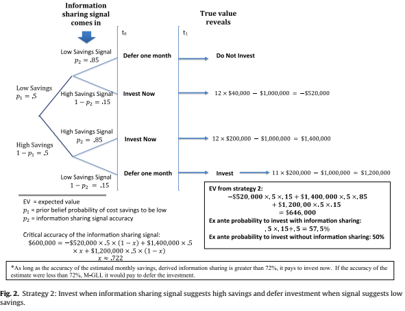

# Readings

## Trends and preventive strategies for mitigating cybersecurity breaches in organizations (2016)

Astani, M., & Ready, K. J. (2016). Trends and preventive strategies for mitigating cybersecurity breaches in organizations. Issues in Information Systems
Volume 17, Issue II, pp. 208-214, 2016. Retrieved from [https://iacis.org/iis/2016/2_iis_2016_208-214.pdf](https://iacis.org/iis/2016/2_iis_2016_208-214.pdf). Journal: [TrendsPreventionBreach.pdf](TrendsPreventionBreach.pdf)

Histrocially attackers have gone after the networking topology directly, however this approach has evolved to target the application directly.  This enables them to avoid many protections like firewalls and go after the data directly.  Their objective typically centers around exfiltration, destruction, or holding hostage.  These issues are becoming fairly common place through simple strategies like malicious email attachments.  When the organization lacks controls to protect against these aspects it costs them an average of 5.5 million dollars to recover.  

### Why does traditional security mitigation fail

> Historically, organizations have relied on perimeter defenses to keep their networks and data secure. Unfortunately, network firewalls and network vulnerability scanners cannot defend against application-level attacks. By design, web applications permit unknown users to interact with data and systems. This interaction passes through network
defense mechanisms such as firewalls and intrusion detection systems, leaving business vulnerable to malicious attacks.

### How much does an incident cost

> Approximately 72 percent of exposed companies employed 100 or fewer individuals, [and encountered an] average cost of a data breach was $5.5 million in 2011, according to the 2011 Cost of Data Breach report.  Recovery costs following a breach typically stem from investigating the cause of the breach; notifying customers or employees affected; managing inquiries
from those affected; public relations; legal defense; regulatory proceedings; fines and penalties; and credit or identity monitoring.

### What causes security incidents and what mitigations are important

| Source| Percentage|
|-------|-----------|
| Crimials | 32|
| Rogue Employees| 19|
|Theft | 33|
| Other| 21|

Table 1. The Importance of Security Matters for Organizations:

|Priority| High| Medium| Low|
|--------|-----|------|-------|
|Data leakage/data loss prevention| 56%| 33%| 11%|
|Business continuity disaster recovery resilience| 55%| 33%| 12%|
|Identity and access management| 47%| 41% |12%|
|Security awareness and training| 44%| 45%| 11%
|Incident response capabilities| 44%| 44%| 12%|
|Security operations (antivirus, patching, encryption)|41%| 44%| 15%|

## Breaking the cyber-security dilemma: aligning security needs and removing vulnerabilities (2014)

Dunn Cavelty M. Breaking the cyber-security dilemma: aligning security needs and removing vulnerabilities. Science and engineering ethics. 2014;20(3):701-715. doi:10.1007/s11948-014-9551-y. Journal: [BreakingCyberDilemma.pdf](BreakingCyberDilemma.pdf)

## STPA-SafeSec: Safety and security analysis for cyber-physical systems (2017)

Friedberg, I., McLaughlin, K., Smith, P., Laverty, D., & Sezer, S. (2017). STPA-SafeSec: Safety and security analysis for cyber-physical systems. Journal of Information Security and Applications Volume 34, Part 2, June 2017, Pages 183-196. [https://doi.org/10.1016/j.jisa.2016.05.008](https://doi.org/10.1016/j.jisa.2016.05.008). Journal: [SafeSec.pdf](SafeSec.pdf)

## Combining cybersecurity and cyber defense to achieve cyber resilience (2017)

Galinec, D., & Steingartner, W. (2017). Combining cybersecurity and cyber defense to achieve cyber resilience. Paper presented at the 14th International Scientific Conference on Informatics.  14-16 Nov. 2017 Poprad, Slovakia. Published by IEEE.  [https://doi.org/10.1109/INFORMATICS.2017.8327227](https://doi.org/10.1109/INFORMATICS.2017.8327227). Conference Paper: [CyberResilience.pdf](CyberResilience.pdf)

## The impact of information sharing on cybersecurity underinvestment: A real options perspective (2015)

Gordon, L. A., Loeb, M. P., Lucyshyn, W., & Zhou, L. (2015). The impact of information sharing on cybersecurity underinvestment: A real options perspective. Journal of Accounting and Public Policy Volume 34, Issue 5, September–October 2015, Pages 509-519. [https://doi.org/10.1016/j.jaccpubpol.2015.05.001](https://doi.org/10.1016/j.jaccpubpol.2015.05.001). Journal: [SecurityUnderInvestment.pdf](SecurityUnderInvestment.pdf)

> These investments relate to such things as encryption techniques, access controls, firewalls, anti-malware software, intrusion prevention and detection systems, data segregation, and personnel training. Clearly, the amount a firm should invest in cybersecurity activities depends (in part) on the cost-benefit (i.e., economic) aspects of such investments.

The authors state that many organizations approach security from a cost-benefit perspective, however this is flawed because it compares a future theoritical cost against an present actualized expense.  This mentality causes many businesses to defer investments until they are in a reactive state versus a proactive scenario.  Executive Order 13636 (Obama 2013), states that _it is the policy of the US Govt to increase the volume, timeliness, and quality of threat information_, to better assist private sector decision makers with this trade-off.

Investments do not need to be now or never, `deferment option` can also take a phased approach that piecemeals iterative improvements.  _As discussed in the real options literature, the value of a deferment option is positively associated with the degree of uncertainty associated with the investment decision’s payoff_ (pg. 513). An example company might allocate 2.5M dollars for security expenditures and permit the CSO to spend 60% on "high probability" (e.g. anti-virus software).  The remaining 40% requires board approval as these less quantifable risks come into scope.  This directly aligns with the goals of Obama to `share risk information`.  Using a weighted expected value  the business can determine if that remaining 1M is better spent today or next month, and these weights require industry specific risk assessments through information sharing.

> There are several implications of the analysis presented in the previous section of this paper. The first implication is that information sharing has the potential for reducing the uncertainty surrounding cybersecurity investment decisions. As a result of this reduction in uncertainty, the value of the option to defer cybersecurity investments is reduced. Thus, as shown in our example, information sharing is likely to have a calculable positive expected value on decisions to invest in cybersecurity activities now rather than to defer such investments. [...] Everything else equal, reducing the uncertainty surrounding cybersecurity investment decisions should encourage more timely, and more cost efficient, cybersecurity investments.

## Holding the Line: Events that Shaped Healthcare Cybersecurity (2017)

Grimes, S., & Wirth, A. (2017). Holding the Line: Events that Shaped Healthcare Cybersecurity. Biomedical Instrumentation & Technology, 51(s6), 30–32. [https://doi-org.proxy1.ncu.edu/10.2345/0899-8205-51.s6.30](https://doi-org.proxy1.ncu.edu/10.2345/0899-8205-51.s6.30).  Article: [EventsShapedHealthcare.pdf](EventsShapedHealthcare.pdf).

This short read highlights the various major events that have caused the current perspective on healthcare security.  These include a evolution toward regulatory requirements such as HIPPA and HITECH that require protections of patient data and devices.  The attacks have also transitioned toward ransomware as this is an economical attack that directly results in financial gains.

## Cybersecurity protection for power grid control infrastructures (2017)

Jarmakiewicz, J., Parobczak, K., & Maślanka, K. (2017). Cybersecurity protection for power grid control infrastructures. International Journal of Critical Infrastructure Protection
Volume 18, September 2017, Pages 20-33. [https://doi.org/10.1016/j.ijcip.2017.07.002](https://doi.org/10.1016/j.ijcip.2017.07.002). Journal: [PowerGridControl.pdf](PowerGridControl.pdf)

## Cybersecurity Concerns and Medical Devices: Lessons From a Pacemaker Advisory (2005)

Kramer, D. B., & Fu, K. (2017). Cybersecurity Concerns and Medical Devices: Lessons From a Pacemaker Advisory. Journal of American Medical Association (JAMA), 318(21), 2077–2078. [https://doi-org.proxy1.ncu.edu/10.1001/jama.2017.15692](https://doi-org.proxy1.ncu.edu/10.1001/jama.2017.15692). Article: [PacemakerAdvisory.pdf](PacemakerAdvisory.pdf)

As pacemakers and other permenant medical devices become more sophisticated there is an increased risk due to the additional attack surface.  In this specific case, the device supports wifi communication for publishing telemetry and downloading fireware updates.  A vulnerability was found in an Abbott Labs model, and this creates challenges with controlling the public relations of the entire industry.  While other models might not exhibit the flaw, it raises concerns from doctors and patients that their sensitive information might be leaked or become infected with malware.

## Attack-prevention and damage-control investments in cybersecurity (2016)

Lam, W. M. W. (2016). Attack-prevention and damage-control investments in cybersecurity. Information Economics and Policy, 37, 42-51. [https://doi.org/10.1016/j.infoecopol.2016.10.003](https://doi.org/10.1016/j.infoecopol.2016.10.003).  Journal: [AttackPrevention.pdf](AttackPrevention.pdf)
