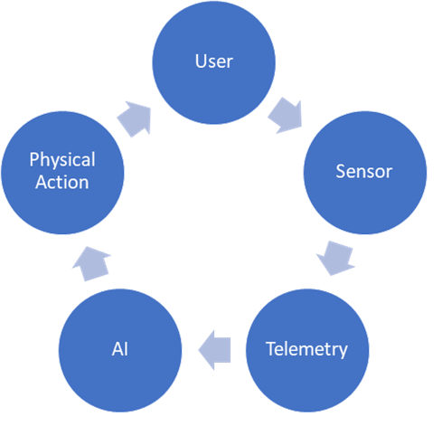

# Future Needs - IoT

The Internet of Things (IoT) represents the next evolutionary step in communication and system connectivity.  Naïve outsiders see this industry as a series of gimmicks, Apple watches, and smart toasters.  Those statements are true, but more importantly, it also creates the missing bridge between cyber and physical systems (CPS).  This capability comes from sensor and input networks that emit telemetry into ubiquitous cloud computing and machine learning platforms.  Using physical motors and actuators, artificial intelligence and big data solutions can then reach back into manufacturing and safety systems.  As information and decision processes transact across this bridge, it enables organizations to execute expert workflows autonomously and prevent costly failures.  However, many challenges exist around ensuring the confidentiality, integrity, and availability (CIA) of all participants of this system.

## People

It can be helpful to think of identity within IoT as a profile of historical choices, stated preferences, user roles, and known associations [Wachter, 2018](https://doi.org/10.1016/j.clsr.2018.02.002).  When the device understands the context of the user’s profile, the experience can be customized and produce more accurate predictions.  The payment for access to these inferences and decision processes comes from personal information, such as calendars, contacts, and routines [Mickens, 2018](https://www.youtube.com/watch?v=ajGX7odA87k).  This trade creates privacy concerns that can be subtle and can go unnoticed for some time.

For instance, numerous platforms integrate into open identity provides like Google and Facebook as a mechanism to simplify enrollment.  However, is that the job the user intended to hire [Dai Zovi, 2019](https://www.youtube.com/watch?v=8armE3Wz0jk)?  Through an exchange of convenience, the user becomes trackable across multiple sites and web services [Paller, Mahalik, Skoudis, & Ullrich, 2020](https://youtu.be/xz7IFVJf3Lk).  While the physical person wants a single sign-on experience, they also desire distinct virtual profiles across those providers (e.g., LinkedIn versus PornHub).  Traditionally users have encountered these entanglements of context on their mobile devices, but these are not the only scenarios.  Asking personal assistants, such as Siri, Alexa, and Google Home, if they spy on us, results in recommendations to review the privacy policy [Haselton, 2018](https://www.cnbc.com/2018/05/13/are-siri-alexa-and-google-assistant-spying-on-me.html).  That response can be misleading since these policies exist as a liability disclaimer, not for the direct benefit of the user [Wachter, 2018](https://doi.org/10.1016/j.clsr.2018.02.002).

## Process

Manufacturing facilities are evolving into massive CPS ecosystems through Industrial IoT devices feeding into complex event processing systems [Babiceanu, 2016](https://doi.org/10.1016/j.compind.2016.02.004).  This approach reduces costs by increasing automation efficiencies.  Reliance on automation also increases the opacity of decision-making processes and introduces additional risk vectors [Mickens, 2018](https://www.youtube.com/watch?v=ajGX7odA87k).  For example, an increase in network latencies might cause decision processes to act on outdated information.  When perspective distortion exists between the cyber and physical structures, then accidents can follow, like autonomous vehicles failing to stop or safety systems not initiating soon enough [Frodigh, 2018](https://www.youtube.com/watch?v=cpeMmMh7Syk).  CPS technologies can enter into this erroneous state due to Denial of Service states (DoS) caused by malicious actors, malware, and negligent administrators.

## Products

According to Gartner, the trend of weak authentication controls impacts nearly 50% of all IoT vendors [Galinec & Steingartner, 2017](https://doi.org/10.1109/INFORMATICS.2017.8327227).  The Mirai malware was able to span half a million devices using a small dictionary file to brute force access [Gamblin, 2017](https://github.com/jgamblin/Mirai-Source-Code).  Although its source code has been available for several years, and its particularly noisy approach to gaining entry are discoverable, variations are still thriving [Kolias, Kambourakis, Stavrou, & Voas, 2017](https://doi.org/10.1109/MC.2017.201).  While these programs should have encouraged a movement toward security by default, the broad industry has failed to act against even this rudimentary attack.

There is an economic incentive for businesses to churn out new IoT devices with more innovative, instead of investing in security protections for those features [Li & Liao, 2018](https://doi.org/10.1016/j.giq.2017.10.006).  For many retail markets, the customer makes purchasing decisions predominantly on which product has the most features at the lowest price.  Meanwhile, devices such as 8-bit micro-controllers, lack the computing resources necessary to support authentication, authorization, auditing, and transport encryption [Weber & Studer, 2016](https://doi.org/10.1016/j.clsr.2016.07.002).  Even when there are sufficient resources available, security protections can cause interoperation (interop) challenges, which leads to customers assuming that the device does not work.  If the customer believes that the equipment is faulty, they leave bad reviews online, contact support, and request replacements—all of which cost the business money.

## Regulation

Creating universal regulations around security and compliance is a very challenging topic due to different political values [Matsubara, 2014](https://doi.org/10.1080/03071847.2014.895263).  Even domestically, states like California, Delaware, and Utah have stricter expectations of privacy than federal requirements.  When states redefine the minimum bar, it varies the expectation of acceptable use and results in litigation risks.  Some organization approaches the problem by meeting the strictest set of requirements, but implementing the best protections might not be feasible on large codebases or limited resources systems [Weber & Studer, 2016](https://doi.org/10.1016/j.clsr.2016.07.002).

When a customer purchases a traditional device, like a video player, they can exert full ownership.  However, with everything as a service (XaaS), manufactures are relying on service integrations and Digital Rights Management (DRM) to retain control after the procurement [Oravec, 2017](https://doi.org/10.1016/j.techsoc.2017.09.004).  These new licensing models enable organizations to collect monthly subscription fees and provide new features through software updates.  This paradigm shift introduces dependencies, where the manufacture becomes liable for the responsible storage of customer data.  Selling these products to international audiences adds additional complexity, as it can bring the Global Data Protection Regulation (GDPR) and similar foreign policy into scope.

## Conclusion

The Internet of Things (IoT) provides a mechanism for bridging the cyber and physical worlds into a unified system.  This bridge enables businesses to collect sensor data for powering artificial intelligence solutions that control mechanical devices (e.g., motors and actuators).  Ensuring the integrity, confidentiality, and availability of that communication channel requires protections for the people, processes, and products that participate in those conversations.  

Unique classes of risk exist against each of these entities that come from several trade-offs between convenience, control, and privacy.  For instance, user profiles provide the capabilities necessary for customizing personalized experiences.  However, leaking that information can generate privacy concerns.  Giving control to autonomous safety systems are only effective if both the cyber and physical structures are in sync.

Nearly half of the IoT manufacturers lack sufficient authentication controls and can become compromised with simple dictionaries.  One of the core challenges comes with a disincentive for the broader industry to mitigate these problems.  Customers choose products that contain the most features at the lowest cost.  These features contain increased attack surface and need to optimize for interoperation scenarios.  Regulation and compliance of these security controls are challenging due to political fragmentation and technical limitations.  For example, building industry-standard encryption protocols on specific embedded systems is not possible given the necessary compute resources.  However, these challenges cannot be the end of the story, and iterative changes can move the industry in the right direction.  For instance, printing a random password onto physical IoT devices can trade (a) reductions of malware spread rates for (b) physical security risk.  While this is not acceptable for military bases, other scenarios like small branch offices might find this amenable.
