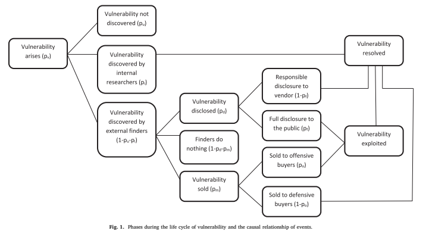

# Future Needs Citations

Several of these `Cyber Physical Systems` (CPS), such as [Industrial] `Internet of Things` (IoT) concepts are further explored in:

- [TIM-7010 Networking: Section 3 IoT](https://github.com/dr-natetorious/TIM-7010-Computer_Networks_and_Mobile_Computing/tree/master/Section_3_IoT)
- [TIM-7010 Networking: SmartCities](https://github.com/dr-natetorious/TIM-7010-Computer_Networks_and_Mobile_Computing/tree/master/Section_4_Application/Week7_Darpa_SmartCity)
- [TIM-8130 Data Mining IoT Capstone](https://github.com/dr-natetorious/TIM-8130-Data_Mining/tree/master/Week8_IoT_Capstone)

## Big Data and virtualization for manufacturing cyber-physical systems: A survey of the current status and future outlook (2016)

Babiceanu, R. F., & Seker, R. (2016). Big data and virtualization for manufacturing cyber-physical systems. Computers in Industry
Volume 81, September 2016, Pages 128-137. [https://doi.org/10.1016/j.compind.2016.02.004](https://doi.org/10.1016/j.compind.2016.02.004). [BigDataVirtualizationSurvey.pdf](BigDataVirtualizationSurvey.pdf).

Manufacturing businesses are evolving into CPS with Industrial IoT devices connected to Big Data analysis systems.  However, there are security risks to these automated decision processes that need to constrained.  These systems rely heavily on _complex event processing_ through cloud computing, and virutalization for simulation of physical processes.  The authors propose a stronger reliance on simulation data as a mechnaism to detect anomalies and provide better protections.

### How are Cyberphysical attacks categorized

- Data integrity attacks, which are executed by corrupting the signals (measurements) of sensors or of the values of control signals. As a result of processing corrupted input values, the control unit would likely provide wrong solutions for the monitored process. Also, by using corrupted control signals, the control unit may direct the actuator to incorrectly action on the monitored process.
- Replay attacks, easily executed on an unsecured network through retransmission of legitimate control or measurement packets several times. These type of attacks are a variation of
data integrity attacks and have the same negative consequences.
- Denial of service attacks, which result into unacceptable delays in the operation of the monitored process, or, many times, total unresponsiveness. Besides the obvious negative effect on applications having required real-time operational scenarios, any delays induced in the operational flow would be detrimental for the overall system efficiency.
- Timing attacks, which result only in delays of communication flow between the control unit and sensor/actuator cyber-physical device. These type of attacks are a variation
of denial of service attacks and have the same consequences, albeit less dramatic, when no real-time requirements are imposed.
- De-synchronization attacks, which are directed towards the processes that require rigorous synchronization. Similar to timing attacks, these type of attacks are a variation of denial of service attacks and carry the same consequences.

## Cybersecurity for Cardiac Implantable Electronic Devices: What Should You Know? (2018)

Baranchuk, A., Refaat, M. M., Patton, K. K., Chung, M. K., Krishnan, K., Kutyifa, V., . . . Lakkireddy, D. R. (2018). Cybersecurity for Cardiac Implantable Electronic Devices: What Should You Know?.  Journal of the American College of Cardiology Volume 71, Issue 11, 20 March 2018, Pages 1284-1288. [https://doi.org/10.1016/j.jacc.2018.01.023](https://doi.org/10.1016/j.jacc.2018.01.023). [CardiacImplants.pdf](CardiacImplants.pdf).

Malicious actors are targeting IoT devices (smartWhatever), and this raises concerns about medical devices like pacemakers and other _Cardiovascular Implantable Electronic Devices_ (CIEDs) (extended: see previous weeks of this course).  If these units become compromised, there is serious risk to the patients mortality.

Regulatory standards are complicated and continuously evolving, and exist as a series of guidelines based on the NIST and ISO recommendations.  While there is little evidence of individuals being targeted, a more likely scenario is malware/ransomware compromising the hospital networks.  This situtation could create a cascade of issues around the integrity of their environment.

## Security Evaluation Framework for Military IoT Devices (2018)

Cha, S., Baek, S., Kang, S., & Kim, S. (2018). Security Evaluation Framework for Military IoT Devices. Security & Communication Networks, 1–12. [https://doi-org.proxy1.ncu.edu/10.1155/2018/6135845](https://doi-org.proxy1.ncu.edu/10.1155/2018/6135845). [MiltaryIoT.pdf](MiltaryIoT.pdf).

Even mission critical systems, such as military CPS technologies requires sourcing components from multiple locations.  Vulnerabilities in those systems can appear in higher-level constructs like GPS devices increasing the attack surface for Jeeps and Trucks.  Across many large organizations and governments, there are numerous security frameworks in use which makes direct comparisons between departments acceptance protocols difficult.  The historical origins of these frameworks also makes their core requirements incompatible in many scenarios, or the backing information (e.g. weapon systems design) classified (unobtainable).

> Simply, the usual way to enhance cybersecurity of the existing systems by introducing security solutions, e.g., frewall and cryptographic devices, is no longer effective.

### How did the authors unify these other systems

- Define Requirements with Risk Identification
- Selecting Appropriate Security Controls from the Requirements
- Convert Controls into the International Standards
- Completion of RFP Evaluation Criteria and Preparation for Proposal Evaluation
- Evaluation of Submitted Proposals and Preverification
- Functional Requirement Verification
- Risk Assessment
- Secure System Integration and Operational Test and Evaluation

## Using virtual environments for the assessment of cybersecurity issues in IoT scenarios (2017)

Furfaro, A., Argento, L., Parise, A., & Piccolo, A. (2017). Using virtual environments for the assessment of cybersecurity issues in IoT scenarios. Simulation Modelling Practice and Theory Volume 73, April 2017, Pages 43-54. [https://doi.org/10.1016/j.simpat.2016.09.007](https://doi.org/10.1016/j.simpat.2016.09.007). [VirtualEnvironmentAssessSecurityIssues.pdf](VirtualEnvironmentAssessSecurityIssues.pdf).

The authors discuss `SMALLWORLD`, a virtualization platform, as mechanism to monitor the interactions between real/virtual devices.  This approach enables them to map out the exploitation of malware in a safe simulation and better understand its behavior.  A strength of this solution, is that it can _detect malicious devices and quarintine_ them vs _manually isolating critical devices_.  Using automation in this scenario could improve the chances that a resource are not missed, due to erroneous procedures.

## DDoS in the IoT: Mirai and other botnets (2017)

Kolias, C., Kambourakis, G., Stavrou, A., & Voas, J. (2017). DDoS in the IoT: Mirai and other botnets. Computer, 50(7), 80-84. [https://doi.org/10.1109/MC.2017.201](https://doi.org/10.1109/MC.2017.201). [DDos_in_IoT.pdf](DDos_in_IoT.pdf).

The ubiquity and increasing popularity of the Internet of Things (IoT) have made IoT devices a powerful amplifying platform for cyberattacks.  These systems are frequently the weakest link, always connected, and make for an exceptionally great DDoS platform.  The [Mirai Malware](https://github.com/jgamblin/Mirai-Source-Code) (Japanese for Future) platform was recorded at peaks of 620Gbps and 1.1 Tbps against Krebs blog and Frech webhost OVH.

Interestingly, despite the malware source code being freely available on the net protections have not followed.  Instead, the number of attacks has increased due to the poor security configuration across the IoT industry in general.  For instance, using a relatively small dictionary it can compromise hundreds of different models because of the hard-coded passwords in the systems exposed to public ports.  While many manufacturing facilities likely believe the device is behind a home firewall, and therefore safe-- this assumption is consistently false.  Once the malware gets past the firewall it can easily spread through home environments that typically have no boundaries to improve usability.

## Blockchain's roles in strengthening cybersecurity and protecting privacy (2017)

Kshetri, N. (2017). Blockchain's roles in strengthening cybersecurity and protecting privacy. Telecommunications Policy, 41, 1027-1038. [https://doi.org/10.1016/j.telpol.2017.09.003](https://doi.org/10.1016/j.telpol.2017.09.003).  [BlockChainPrivacy.pdf](BlockChainPrivacy.pdf).

Blockchain offers protections against data becoming tampered or stolen, due to the decentralized and replicated nature of the ledger.  For an attacker to defeat this mitigation, they would need control of 51% of the nodes.  The multi-signature solution has other potential implications for IoT devices and end-user privacy, specifically around replay and spoofing attacks.

However, as other authors have noted (e.g., Hunt week 1), end-users do not understand these protections and that introduces challeges surfacing to higher levels.  If the technology targets lower-levels (e.g., machine to machine)-- there are complexities with the depth of the ledger, especially in dynamic environments (see TIM-7010).  Targeting protocols in the middle, like DNS would be prohibitively expensive and that has led to competing approaches like DNSSec.

## Economic solutions to improve cybersecurity of governments and smart cities via vulnerability markets (2018)

Li, Z., & Liao, Q. (2018). Economic solutions to improve cybersecurity of governments and smart cities via vulnerability markets. Government Information Quarterly Volume 35, Issue 1, January 2018, Pages 151-160. [https://doi.org/10.1016/j.giq.2017.10.006](https://doi.org/10.1016/j.giq.2017.10.006).  [EconomicSolutions.pdf](EconomicSolutions.pdf).

The innovation rate in smart city and mobile development is occuring faster than security tooling to ensure the confidentiality, integrity, and availability of those services.  The authors state that this is because of economic incentives that discourage investments into security systems -- ala. _customers buy features, not protections_.  They propose changes in policies that could skew the calculus, such that external actors are less likely to sell the vulnerability.

## Deployment of cybersecurity for managing traffic efficiency and safety in smart cities (2017)

Li, Z., & Shahidehpour, M. (2017). Contemporary strategies for microgrid operation & control: Deployment of cybersecurity for managing traffic efficiency and safety in smart cities. The Electricity Journal Volume 30, Issue 4, May 2017, Pages 52-61. [https://doi.org/10.1016/j.tej.2017.04.003](https://doi.org/10.1016/j.tej.2017.04.003). [ManageTrafficSmartCity.pdf](ManageTrafficSmartCity.pdf).

Metropolitan areas that adopt traffic management technologies as part of a smart city strategy can reduce congestion and route vehicles more efficient.  However, this also recreates scenarios where an attacker can manipulate the state, such as improving their route at the expense of other drivers.

## Kill switches, remote deletion, and intelligent agents (2017)

Oravec, J. A. (2017). Kill switches, remote deletion, and intelligent agents: Framing everyday household cybersecurity in the Internet of Things. Technology in Society Volume 51, November 2017, Pages 189-198. [https://doi.org/10.1016/j.techsoc.2017.09.004](https://doi.org/10.1016/j.techsoc.2017.09.004). [KillSwitches.pdf](KillSwitches.pdf).

There is a growing divide between product ownership and product control, such that manufactures have remote rights through the service integrations.  For instance, a coffee maker might offer a particular flavor one month, then through Digital Media Rights revoke that option later.  While the device still has the capability to produce that flavor, the functionality is disabled -- making for a radically different paradym shift.

This leads into a series of interesting privacy concerns as more complex functionality also needs to remote into the cloud.  Who is listening to our Alexa commands?  Perhaps the users trust Amazon or naively believe there's too many requests to find something of interest (the needle in a haystack theory).  That perspective is flawed, as big data technologies can act as a magnet -- sucking out the needle with ease.

## Normative challenges of identification in the Internet of Things: Privacy, profiling, discrimination, and the GDPR (2018)

Wachter, S. (2017). Normative challenges of identification in the Internet of Things: Privacy, profiling, discrimination, and the GDPR. Computer Law & Security Review Volume 34, Issue 3, June 2018, Pages 436-449. [https://doi.org/10.1016/j.clsr.2018.02.002](https://doi.org/10.1016/j.clsr.2018.02.002). [ChallengesIdentificationIoT.pdf](ChallengesIdentificationIoT.pdf).

## An extended car-following model to describe connected traffic dynamics under cyberattacks (2018)

Wang, P., Yu, G., Wu, X., Qin, H., & Wang, Y. (2018). An extended car-following model to describe connected traffic dynamics under cyberattacks. Physica A: Statistical Mechanics and its Applications Volume 496, 15 April 2018, Pages 351-370. [https://doi.org/10.1016/j.physa.2017.12.013](https://doi.org/10.1016/j.physa.2017.12.013). [CarFollowingModel.pdf](CarFollowingModel.pdf).

## Cybersecurity in the Internet of Things: Legal aspects (2016)

Weber, R. H., & Studer, E. (2016). Cybersecurity in the Internet of Things: Legal aspects. Computer Law & Security Review. Volume 32, Issue 5, October 2016, Pages 715-728. [https://doi.org/10.1016/j.clsr.2016.07.002](https://doi.org/10.1016/j.clsr.2016.07.002). [IoT_LegalAspects.pdf](IoT_LegalAspects.pdf).

Creating universal regulations across IoT devices is a very challenging topic, due to different political values (see Week 3).  The Budapest Converntion of 2001 was the first ambitious effort to standardize international law, but it fell short of that goal.  For instance, underdeveloped countries lacked the technical expertice to meet the standard and lacked any real representation in the process either way.  Some contries felt that it did not go far enough, and mandated a higher miniumum bar -- negating the value of having a single solution.  Many modern attack vectors are not covered, such as ransomware making the entire process out of touch with the current state of the world.

There are also unavoidable limitations that will not be overcome from decades if ever.  For instance, an 8-bit micro-controller can be mass produced extremely cheaply and so there is a lot of value using this technology in light sensors.  However, it does not have the processing capabilities to implement industry-grade encryption.  Given this constraint, how could these controllers ever meet any reasonable expectation of AAA (authentication, authorization, and auditing) -- let alone transport encryption?
